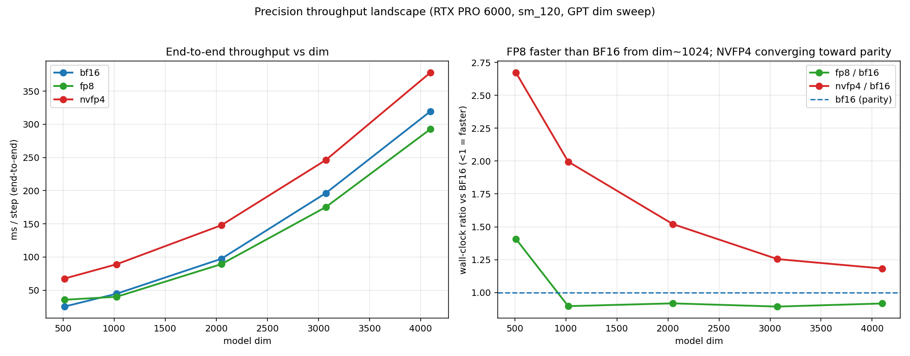

# nvfp4-pretrain

**4-bit and 8-bit LLM training on a single consumer Blackwell GPU (RTX PRO 6000, sm_120, 96 GB)** — where NVIDIA's Transformer Engine doesn't run.

This is a research log + working code for low-precision pretraining on one GPU: custom NVFP4 (4-bit float) quant/GEMM kernels, an FP8 path, a CUTLASS sm_120 GEMM tuned per training shape, the Muon optimizer, and an end-to-end overnight pretrain. Every number in the docs is from a green, validated run.

> **TL;DR.** NVFP4 4-bit training works and, with the kernel + optimizer work here, goes from **4.3× slower than BF16 to faster** at scale — but **FP8 (tensorwise e4m3) is the pragmatic sweet spot** (no Hadamard/stochastic-rounding, ~10% faster, ~2× more memory-efficient, identical convergence). On a VRAM-budgeted box the real win is **capability per budget** (fit a ~2× bigger model), not speed at fixed size. End-to-end MFU tops out at **~42%** — which *is* the Llama-3 frontier range, not the 90% one might hope. Frontier-6.5B-from-scratch stays a cluster-months FLOP problem; the validated stack is a real foundation for **adapting big checkpoints** or **fully training small models**.

## Headline results

| | result |
|---|---|
| **NVFP4 training** | validated, bitwise-clean kernels; converges identically to BF16 at every size |
| **FP8 vs BF16** | ~10% faster end-to-end (dim≥1024), tensorwise > rowwise, no Hadamard/SR |
| **Capability/VRAM** | FP8 + 8-bit AdamW fits ~2× bigger model in 96 GB (3.3B → 6.5B) |
| **MFU** | ~42% (= PaLM 46% / Llama-3 38-43% frontier range; 90% isn't real) |
| **Muon** | tuned (lr≈0.01) beats AdamW by 0.32 val at fixed tokens |
| **CUTLASS tuning** | bf16-out kernel unlocks 256×128 Cooperative + StreamK; +14-33% on wgrad/big shapes |
| **Overnight pretrain** | 554M NVFP4 + tuned-CUTLASS + Muon, 693M tokens in 5.5h, val 3.32, stable |



## Where to read
- **[FINDINGS.md](FINDINGS.md)** — the one-page synthesis (start here).
- **[DEVLOG.md](DEVLOG.md)** — the full journey, 16 sections (results + the wrong turns, corrected).
- **[REPORT.md](REPORT.md)** — the FP8 vs NVFP4 vs BF16 sweep.
- **[cutlass_gemm/SHAPE_TUNING.md](cutlass_gemm/SHAPE_TUNING.md)** — per-shape CUTLASS tuning.
- **results/** — all figures + raw `.jsonl`.

## Layout
```
nvfp4_*.py, cast_transpose_quant.py, fused_ce.py   core NVFP4 quant + FP4Linear + kernels
cutlass_gemm/      CUTLASS sm_120 NVFP4 GEMM (.cu, build scripts, torch ext, parity tests)
scaling/           trainer (train_text.py: BF16 / FP8 / NVFP4, Muon, 8-bit AdamW) + plots
te/                Transformer Engine sm_120 evidence (it crashes here) + degrade patch
tests/             numeric-correctness / parity harnesses
benchmarks/        profiling + microbenchmarks
results/           figures + jsonl
```

## Hardware / stack
RTX PRO 6000 Blackwell Workstation (sm_120, cc 12.0, 96 GB GDDR7, ~1.8 TB/s). torch 2.11+cu130, torchao 0.17, triton 3.6, CUDA 13.2, CUTLASS 4.5. The CUTLASS GEMM needs a local CUTLASS checkout (external dependency, not vendored).

## Quickstart (sketch)
```bash
pip install -r requirements.txt           # torch, torchao, bitsandbytes, triton, matplotlib
# BF16 / FP8 / NVFP4 are env-selected on the trainer:
cd scaling
python train_text.py --dim 1024 --nl 6 --bs 16 --T 512 --steps 1000     # bf16
FP8=1 python train_text.py ...                                          # fp8 (torchao)
NVFP4_CUDA=1 NVFP4_AMORTIZE=1 NVFP4_CUTLASS=1 MUON=1 MUON_LR=0.01 python train_text.py ...  # nvfp4 + tuned CUTLASS + Muon
```
(JIT-builds the CUDA/CUTLASS extensions on first import; needs `CUDA_HOME=/usr/local/cuda-13`, `unset LD_PRELOAD`, and an OpenWebText `.bin` à la nanoGPT.)

## Honest caveats
- Single GPU only; no multi-GPU / FSDP.
- No model weights are checkpointed — the runs are exploratory (loss-trajectory only).
- The 85%-SoL kernel target is unreachable on the M-heavy small-K shapes (sm_120's forced 1×1×1 cluster); see SHAPE_TUNING.md for which shapes cap where and why.
- Scaling laws shown at small converged scale; large-model L(N) leans on published results.

## License
See [LICENSE](LICENSE). Built on NVIDIA CUTLASS examples (BSD-3). Research code — expect rough edges.
